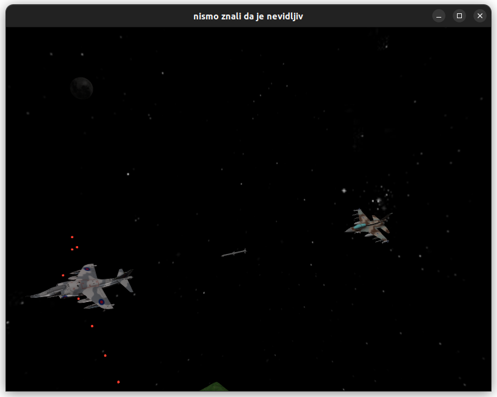

# Računarska Grafika - Projekat - Battlefield

---------------------
# Komande

`F1` - on/off Imgui

`G`  - on/off Gamma

`L`  - switch between Phong/Blinn-Phond model light

`N` - lower Exposure

`M` - higher Exposure

`H` - off/on HDR

`B` - off/on Bloom

`X` - off/on Grayscale

 

---------------------

# Implementirano iz A:
- [x] Cubemaps

- [x] Anti Aliasing

# Implementirano iz B:
- [x] Bloom

- [x] HDR

 

------------------------
# Demonstration

------------------------
# Student:
* Lazar Dunjić, 265/2021 (GitHub username: arshavin166)
